# Hi, I'm snowstorm ❄️

*Slow growth still finds the light.*

- 🎓 **Artificial Intelligence & Automation · HUST**
- 🌱 Learning **PyTorch, LLMs, and RAG**
- 🔎 Building [**Traceable RAG**](https://github.com/snowstorm-121/traceable-rag), a local retrieval prototype
- 🧠 Recording my [**PyTorch learning journey**](https://github.com/snowstorm-121/pytorch_learning)
- 📍 Based in **Wuhan, China**
- ✍️ Writing about [**learning and life**](https://snowstorm-121.github.io/)

 

  <picture>
    <source media="(prefers-color-scheme: dark)" srcset="https://raw.githubusercontent.com/snowstorm-121/snowstorm-121/main/profile/github-snake-dark.svg" />
    <source media="(prefers-color-scheme: light)" srcset="https://raw.githubusercontent.com/snowstorm-121/snowstorm-121/main/profile/github-snake.svg" />
    
  </picture>

